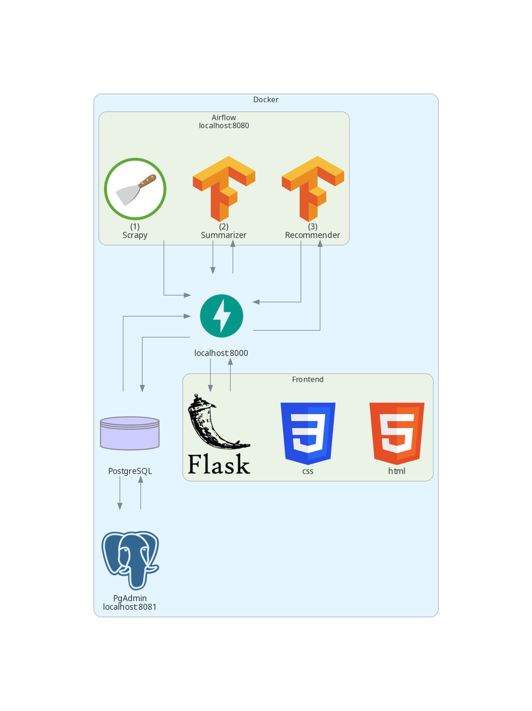
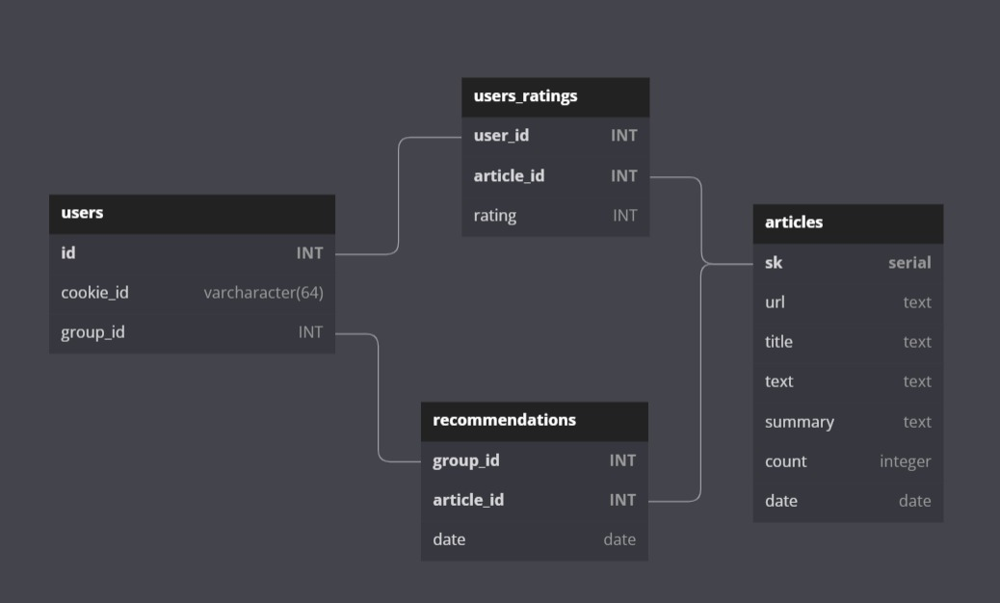

# News-Recommender

This is a project to scrape as many news articles as possible, made for CSE321 Project Based Learning course. The list of websites currently include: Vox, BBC, Washington Post, New York Times, Fox News, The Guardian.

Adding new English websites to the project is as simple as adding the RSS feeds link to the `rssfeeds.py` file. It only supports websites that write dates in English or Numeric formats.

The project uses:
- scrapy framework for scraping and pipelining to a postgres database, scrapy offers many features out-of-the-box that other webscraping libraries do not. Such features include: logging, concurrency, codes handling, .. etc.
- airflow for orchesteration. Airflow provides many useful tools like masking passwords, access control, and web UI for monitorization. 
- Docker to make both installation and development easier. The project uses many services like postgres, pgadmin, airflow UI, an api for the database, starting all of them with a single line saves a lot of effort.
- Fast api to integrate the database easily with ML models and the web frontend.
- Pytorch, transformers, gensim and sklearn to build the summarizer and the recommender systems.
- JS, HTML, CSS to build the frontend.

The project was challenging on so many levels. Reducing the scraping time of hundreds of articles to a few minutes was the major challenge that led me to choose scrapy for the project, and scrapy took me some time to learn. The ability to continue working across the different OS installed on my device led me to Docker and Docker-compose; it saved me alot of trouble that I figured that I would include it in the final version of the project.

---

## Architecture



## Data model

This is a very basic model that was intended to simply store the data effictively.



---

## Installation and running
Note that because this project has ML models for summarization and recommendation both containerized, the project works best on the OS mentioned [here](https://docs.nvidia.com/datacenter/cloud-native/container-toolkit/install-guide.html). I used Ubuntu 20.04 for this project. 

Just download [docker](https://docs.docker.com/engine/install/) and [docker-compose](https://docs.docker.com/compose/install/) from the official docker website, clone the repo, move to the top-level directory and run `sudo docker-compose up` or `sudo docker compose up` depending on your installation of docker compose.

This will start pgAdmin on port 8081 with login credentials `admin@admin.com` and `root`, start a server and add the following connection credentials:
```
hostname/address: pgdatabase
username: root
passwrod: root
```
leave everything else as it is.

It will also start Airflow UI on port 8080, use login credentials `airflow` and `airflow`, from there you should see the DAG of the scrapy scraper, enable it and watch the data start flowing into the database from pgAdmin.

The scraped data will persist even after system reboot.

With some simple knowledge in docker, you can change these login credentials and port numbers easily.

Note: You might need to `chown` of the `data/pgadmin` directory to `5050:5050` to be able to start `pgadmin` service. Changes like copying the project or adding it to github might require you to `chown` of the entire directory `.` to your user. Don't forget the `-R` flag.

---
